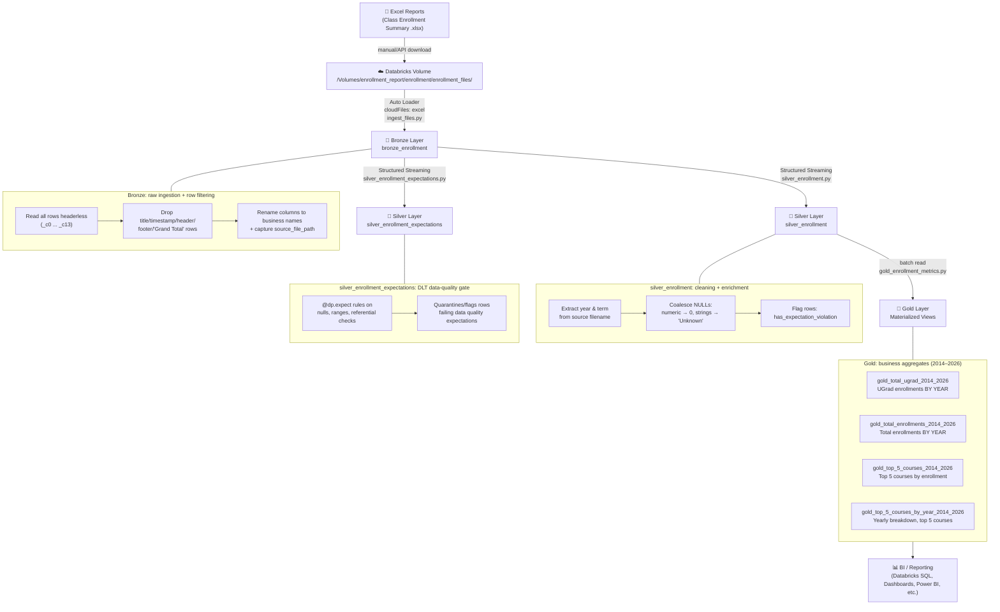

# Course Enrollment Trends — Databricks Lakeflow Pipeline

A Databricks **Lakeflow Declarative Pipeline** (Delta Live Tables) that ingests raw course enrollment
Excel reports and transforms them through a **Medallion Architecture** (Bronze → Silver → Gold) into
analytics-ready aggregate tables for enrollment trend reporting.

Source data: [Harvard Open Data Project — Course Enrollment Trends](https://www.hodp.org/project/course-enrollment-trends/)

---

## 📐 Architecture Diagram



### 📸 Actual Pipeline Graph (Databricks Lakeflow UI)


> Live run of the `course_enrollment_trend` pipeline. `bronze_enrollment` (84K records) streams into two Silver tables — `silver_enrollment` (84K records, full clean/enrich) and `silver_enrollment_expectations` (2.4K records, the subset flagged/quarantined by data-quality expectations). Both feed the four Gold materialized views: `gold_top_5_courses_2014_2026` (5 rows), `gold_top_5_courses_by_year_2014_2026` (75 rows), `gold_total_enrollments_2014_2026` (13 rows — one per year), `gold_total_ugrad_2014_2026` (13 rows — one per year).

---

## 🗂️ Medallion Layer Breakdown

### 🥉 Bronze — `bronze_enrollment`
- **Source:** Raw `.xlsx` enrollment reports landed in a Databricks Volume.
- **Ingestion:** Auto Loader (`cloudFiles`, format `excel`), streaming, schema evolution disabled (required for Excel).
- **Logic:** Each file contains title rows, a timestamp row, a header row, data rows, and footer notes. Bronze reads everything headerless (`_c0`…`_c13`) and filters out non-data rows (titles, timestamps, header repeats, `Grand Total`, filter-criteria rows, row-count footers).
- **Output:** Renamed business columns (`Course_ID`, `Course_Title`, `UGrad`, `Grad`, … `Total`) plus `source_file_path` metadata for lineage back to the originating file.

### 🥈 Silver — `silver_enrollment`
- **Source:** Streams from `bronze_enrollment`.
- **Logic:**
  - Extracts `year` and `term` (Fall/Spring) from the source filename using regex (handles formats like `fall_1998` and `3.19.24`).
  - Coalesces NULLs: numeric enrollment columns (`UGrad`, `Grad`, `NonDegree`, `XReg`, `VUS`, `Employee`, `Withdraw`, `Total`) → `0`; string columns → `'Unknown'`; missing year → `0`.
  - Adds a `has_expectation_violation` boolean flag rather than dropping rows, preserving data completeness while surfacing data-quality issues.
- **Output:** A fully cleaned, typed, queryable enrollment table — no rows dropped. **84K records** in the current run.

### 🥈 Silver — `silver_enrollment_expectations`
- **Source:** Also streams from `bronze_enrollment`, in parallel with `silver_enrollment`.
- **Logic:** Applies Lakeflow **data-quality expectations** (`@dp.expect` / `@dp.expect_or_drop` style rules) — e.g. non-null checks, valid ranges, referential checks against known course/term values.
- **Purpose:** Acts as a dedicated quality gate that isolates the subset of records failing expectations, separate from the "keep everything, just flag it" approach used in `silver_enrollment`. **2.4K records** (the flagged/quarantined subset) in the current run.

### 🥇 Gold — Materialized Views (2014–2026)
Built from `silver_enrollment`, each as a `@dp.materialized_view`, defined in `gold_enrollment_metrics.py`:

| View | Purpose | Output records |
|---|---|---|
| `gold_total_ugrad_2014_2026` | Total undergraduate enrollments **grouped by year** | 13 (one per year, 2014–2026) |
| `gold_total_enrollments_2014_2026` | Total enrollments (all student categories) **grouped by year** | 13 (one per year, 2014–2026) |
| `gold_top_5_courses_2014_2026` | Top 5 courses ranked by total enrollment | 5 |
| `gold_top_5_courses_by_year_2014_2026` | Year/term enrollment breakdown for the top 5 courses | 75 |

---

## 🛠️ Tech Stack

- **Databricks Lakeflow Declarative Pipelines** (`pyspark.pipelines` / DLT)
- **Auto Loader** (`cloudFiles`) for incremental Excel ingestion
- **Delta Lake** for ACID storage across all three layers
- **PySpark / Spark SQL** for transformations
- **Unity Catalog Volumes** for raw file landing

---

## 📁 Suggested Repo Structure

```
course-enrollment-trends/
├── README.md
├── images/
│   └── pipeline_graph.png        # Screenshot of the live Lakeflow pipeline DAG
├── pipelines/
│   ├── ingest_files.py            # Bronze: bronze_enrollment
│   ├── silver_enrollment.py       # Silver: silver_enrollment
│   ├── silver_enrollment_expectations.py  # Silver: data-quality gate
│   └── gold_enrollment_metrics.py # Gold: 4 materialized views
└── pipeline.yml                   # Lakeflow pipeline definition (bronze → silver → gold)
```

---

## ▶️ How It Runs

1. Raw `.xlsx` files are dropped into the Unity Catalog Volume path.
2. Auto Loader picks up new files incrementally and streams them into `bronze_enrollment`.
3. `silver_enrollment` streams from Bronze, cleans, and enriches the data.
4. Gold materialized views recompute business metrics whenever the pipeline runs.
5. Downstream BI tools query the Gold tables directly via Databricks SQL.

## 📌 Notes / Future Improvements
- Add data quality **expectations** (`@dp.expect`) instead of a manual violation flag, to leverage native DLT metrics.
- Parameterize the `2014–2026` year window instead of hardcoding it in each Gold view.
- Add a dashboard (Databricks SQL / Power BI) screenshot or link once built.
