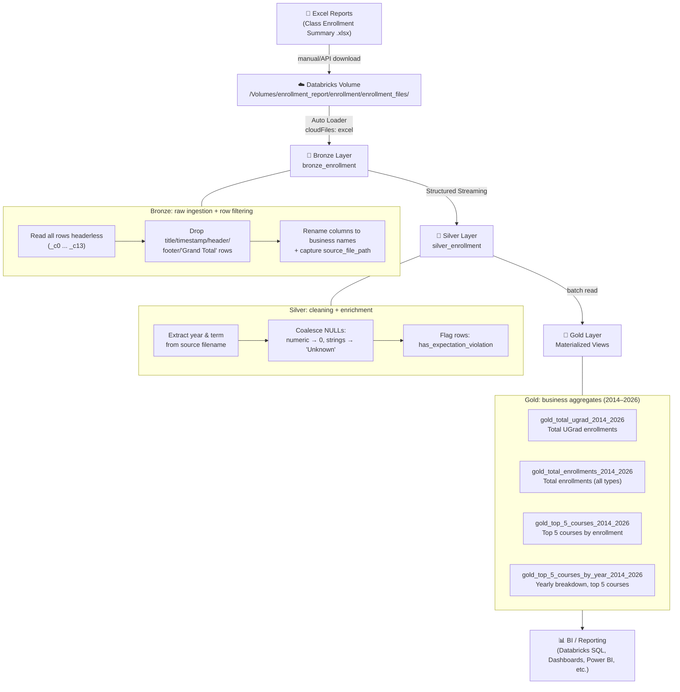

# Course Enrollment Trends — Databricks Lakeflow Pipeline

A Databricks **Lakeflow Declarative Pipeline** (Delta Live Tables) that ingests raw course enrollment
Excel reports and transforms them through a **Medallion Architecture** (Bronze → Silver → Gold) into
analytics-ready aggregate tables for enrollment trend reporting.

Source data: [Harvard Open Data Project — Course Enrollment Trends](https://www.hodp.org/project/course-enrollment-trends/)

---

## 📐 Architecture Diagram



---

## 🗂️ Medallion Layer Breakdown

### 🥉 Bronze — `bronze_enrollment`
- **Source:** Raw `.xlsx` enrollment reports landed in a Databricks Volume.
- **Ingestion:** Auto Loader (`cloudFiles`, format `excel`), streaming, schema evolution disabled (required for Excel).
- **Logic:** Each file contains title rows, a timestamp row, a header row, data rows, and footer notes. Bronze reads everything headerless (`_c0`…`_c13`) and filters out non-data rows (titles, timestamps, header repeats, `Grand Total`, filter-criteria rows, row-count footers).
- **Output:** Renamed business columns (`Course_ID`, `Course_Title`, `UGrad`, `Grad`, … `Total`) plus `source_file_path` metadata for lineage back to the originating file.

### 🥈 Silver — `silver_enrollment`
- **Source:** Streams from `bronze_enrollment`.
- **Logic:**
  - Extracts `year` and `term` (Fall/Spring) from the source filename using regex (handles formats like `fall_1998` and `3.19.24`).
  - Coalesces NULLs: numeric enrollment columns (`UGrad`, `Grad`, `NonDegree`, `XReg`, `VUS`, `Employee`, `Withdraw`, `Total`) → `0`; string columns → `'Unknown'`; missing year → `0`.
  - Adds a `has_expectation_violation` boolean flag rather than dropping rows, preserving data completeness while surfacing data-quality issues.
- **Output:** A fully cleaned, typed, queryable enrollment table — no rows dropped.

### 🥇 Gold — Materialized Views (2014–2026)
Built from `silver_enrollment`, each as a `@dp.materialized_view`:

| View | Purpose |
|---|---|
| `gold_total_ugrad_2014_2026` | Total undergraduate enrollments across all courses |
| `gold_total_enrollments_2014_2026` | Total enrollments (all student categories combined) |
| `gold_top_5_courses_2014_2026` | Top 5 courses ranked by total enrollment |
| `gold_top_5_courses_by_year_2014_2026` | Year/term enrollment breakdown for the top 5 courses |

---

## 🛠️ Tech Stack

- **Databricks Lakeflow Declarative Pipelines** (`pyspark.pipelines` / DLT)
- **Auto Loader** (`cloudFiles`) for incremental Excel ingestion
- **Delta Lake** for ACID storage across all three layers
- **PySpark / Spark SQL** for transformations
- **Unity Catalog Volumes** for raw file landing

---

## 📁 Suggested Repo Structure

```
course-enrollment-trends/
├── README.md
├── pipelines/
│   ├── bronze_enrollment.py
│   ├── silver_enrollment.py
│   └── gold_enrollment_metrics.py
└── pipeline.yml   # Lakeflow pipeline definition (bronze → silver → gold)
```

---

## ▶️ How It Runs

1. Raw `.xlsx` files are dropped into the Unity Catalog Volume path.
2. Auto Loader picks up new files incrementally and streams them into `bronze_enrollment`.
3. `silver_enrollment` streams from Bronze, cleans, and enriches the data.
4. Gold materialized views recompute business metrics whenever the pipeline runs.
5. Downstream BI tools query the Gold tables directly via Databricks SQL.

## 📌 Notes / Future Improvements
- Add data quality **expectations** (`@dp.expect`) instead of a manual violation flag, to leverage native DLT metrics.
- Parameterize the `2014–2026` year window instead of hardcoding it in each Gold view.
- Add a dashboard (Databricks SQL / Power BI) screenshot or link once built.
